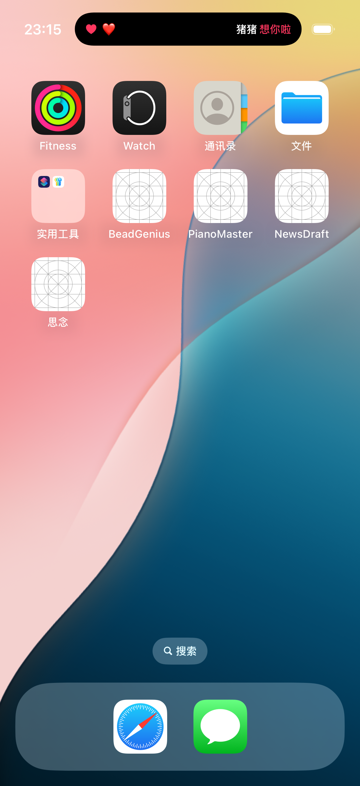
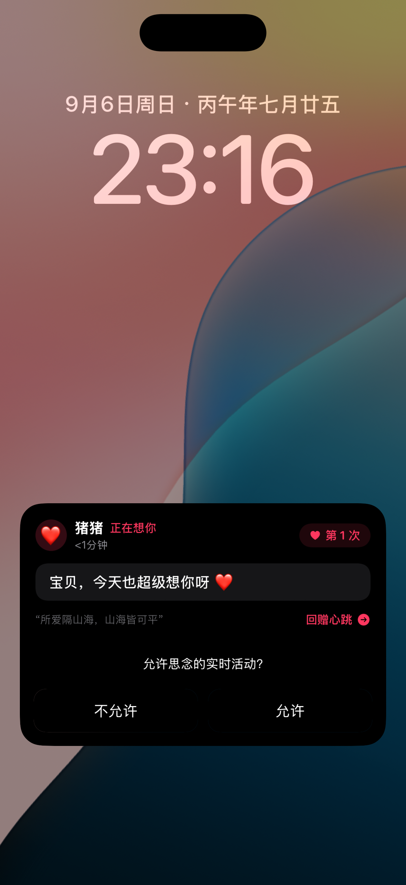

# 《思念 · Sinian》- 情侣即时想念与灵动岛互动 App

<div align="center">
  
  <p><b>“所爱隔山海，山海皆可平”</b> —— 专为情侣设计的跨设备即时想念传递与 iOS 灵动岛特效 App</p>
</div>

---

## 📸 精彩效果预览

<div align="center">
  <table>
    <tr>
      <td align="center" width="33%">
        <b>📱 App 主交互界面</b><br/><br/>
        <br/>
        <i>极具呼吸感的脉冲心跳按钮与想念足迹</i>
      </td>
      <td align="center" width="33%">
        <b>🏝️ 灵动岛紧凑态</b><br/><br/>
        <br/>
        <i>双岛分割模式下完整呈现爱心与对方昵称</i>
      </td>
      <td align="center" width="33%">
        <b>🔒 锁屏实时活动</b><br/><br/>
        <br/>
        <i>息屏常亮高质感毛玻璃卡片与一键回赠</i>
      </td>
    </tr>
  </table>
</div>

---

## ✨ 核心功能特性

1. **灵动岛（Dynamic Island）全形态优雅适配**：
   - **紧凑态（Compact）**：左侧跳动爱心与伴侣昵称（`❤️ 宝贝`），右侧展现想念寄语（`🥰 想你啦`）；
   - **双岛分割模式兼容**：即便开启手机共享热点、后台通话，也能完美适配极小态（`❤️ 宝`），文字绝不丢失；
   - **展开态（Expanded）**：长按灵动岛弹出全屏浪漫卡片，呈现心跳连线、今日累计想念统计、一键“我也想你”和“收起”快捷按钮；
   - **自动优雅收起**：默认停留 15 秒后平滑淡出，不长期霸占灵动岛；支持 15 秒 / 30 秒 / 常驻陪伴三档模式自由切换。

2. **多感官心跳触觉反馈**：
   - **轻触即发**：微心跳震动与爱心粒子漫天飞舞；
   - **长按蓄力**：环形光带渐进蓄力，释放瞬间发出“超级想念 🌟”；
   - **仿生生理心跳**：基于 iOS `CoreHaptics` 深度调校模拟真实“咚-咚”双脉冲心跳。

3. **毫秒级跨设备直连与单机双角色模式**：
   - **甜蜜配对**：双方输入相同暗号（如 `LOVE-520`）即可通过 WebSocket 直连互通；
   - **单机体验**：即便只有一台设备，也可在主界面一键“模拟对方想念”，秒级体验接收方灵动岛效果。

---

## 🏗️ 项目架构

```
sinian/
├── Sinian/                               # 主应用工程
│   ├── App/
│   │   ├── SinianApp.swift               # App 入口（处理 LiveActivity 与 URL 跳转）
│   │   └── Info.plist                    # 权限与 Live Activities 配置 (NSSupportsLiveActivities)
│   ├── Models/
│   │   ├── MissYouAttributes.swift       # ActivityKit 跨 Target 共享数据契约
│   │   ├── PairSession.swift             # 情侣配对状态与偏好设置
│   │   └── MissEvent.swift               # 想念事件数据模型
│   ├── Services/
│   │   ├── LiveActivityManager.swift     # 灵动岛 ActivityKit 生命周期管理（含定时自动收起）
│   │   ├── HapticManager.swift           # CoreHaptics 心跳触觉引擎
│   │   └── SyncService.swift             # WebSocket / HTTP 双端实时信令同步
│   └── Views/
│       ├── MainView.swift                # 主交互视图（心跳按钮、情侣状态、灵动岛卡片）
│       ├── PairingView.swift             # 情侣配对与连接设置
│       ├── MemoryTimelineView.swift      # 今日想念足迹流水
│       └── Components/
│           ├── HeartbeatButton.swift     # 呼吸心跳与粒子动效按钮
│           └── IslandSimulatorCard.swift # 灵动岛交互调试卡片
├── SinianIslandWidget/                   # 灵动岛 Widget Extension
│   ├── SinianIslandWidgetBundle.swift    # 小组件入口
│   ├── SinianIslandWidget.swift          # Dynamic Island 布局（紧凑/展开/极小态）
│   ├── LockScreenActivityView.swift      # 锁屏磨砂玻璃卡片视图
│   └── Info.plist
├── server/                               # 轻量级配对与信令服务器
│   ├── package.json
│   └── server.js                         # WebSocket + REST 配对广播服务
├── docs/                                 # 详细工程文档
│   ├── ARCHITECTURE.md                   # 深度系统架构与技术方案
│   ├── PAIRING_GUIDE.md                  # 双人联机与真机配对指南
│   ├── OPERATION_GUIDE.md                # 启停与日常运维操作手册
│   └── assets/                           # 效果预览截图
├── scripts/                              # 一键启停脚本
│   ├── start.sh                          # 一键启动信令服务与探测 IP
│   └── stop.sh                           # 一键关闭服务与清理模拟器
├── Sinian.xcodeproj                      # Xcode 完整工程文件
└── generate_project.py                   # Xcode 工程自动生成脚本
```

---

## 🚀 快速上手

### 1. 一键启动信令服务
```bash
./scripts/start.sh
```
> 脚本将自动探测本机局域网/热点 IP 并后台运行信令服务，终端会直接输出真机 App 可填写的 IP 地址。

若需停止所有后台服务与模拟器：
```bash
./scripts/stop.sh
```

### 2. 编译运行 iOS App
在 Mac 终端中进入根目录：
```bash
open Sinian.xcodeproj
```
- 选择 **`Sinian`** Scheme；
- 目标设备选择支持灵动岛的设备（如 **iPhone 16 Pro** / **iPhone 15 Pro** / 真机）；
- 按快捷键 `Command + R` 即可编译运行。

### 3. 双人联机配对指南
详见 **[双人联机与真机配对指南 (docs/PAIRING_GUIDE.md)](docs/PAIRING_GUIDE.md)**。

---

## 📖 进阶文档

- [启停与日常运维操作手册 (docs/OPERATION_GUIDE.md)](docs/OPERATION_GUIDE.md)
- [系统架构与技术实现 (docs/ARCHITECTURE.md)](docs/ARCHITECTURE.md)
- [双人联机与真机配对指南 (docs/PAIRING_GUIDE.md)](docs/PAIRING_GUIDE.md)

---

## 📄 开源许可证

本项目基于 MIT License 开源。
