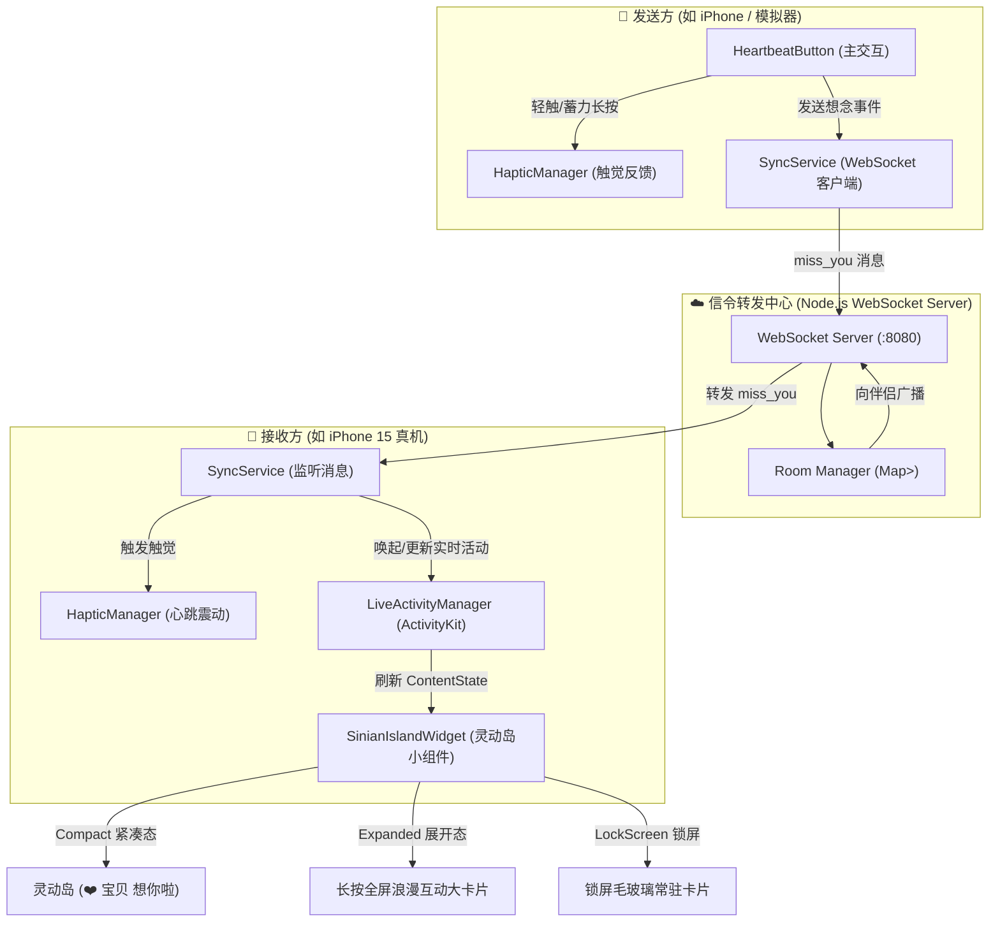

# 《思念 · Sinian》架构与技术实现文档

《思念》（Sinian）是一个专为情侣设计的即时想念传递与 iOS 灵动岛互动系统。本文档详细阐述其系统架构、ActivityKit 灵动岛设计模式、CoreHaptics 震动引擎与 WebSocket 信令协议。

---

## 🏗️ 总体架构图



---

## 1. 灵动岛与 ActivityKit 生命周期设计

### 1.1 跨 Target 共享数据契约 (`MissYouAttributes`)

通过遵循 `ActivityAttributes` 协议，定义了在主 App 和 Widget Extension 之间共享的静态属性与动态内容状态：

```swift
public struct MissYouAttributes: ActivityAttributes {
    public struct ContentState: Codable, Hashable {
        public var senderName: String      // 想念发送方昵称
        public var partnerName: String     // 接收方昵称
        public var message: String         // 想念寄语
        public var emoji: String           // 情感表情 (如 ❤️, 🥰, 🫂)
        public var missCount: Int          // 当日累计想念次数
        public var actionType: String      // 动作类型 (tap / super_miss)
        public var lastSentAt: Date        // 最新发送时间戳
    }
    public var pairId: String              // 情侣专属房间/配对标识
}
```

### 1.2 灵活生命周期与双模式支持

- **即时特效模式（默认 15 秒）**：
  伴侣发来想念时唤起灵动岛跳动，定时器倒计时结束后，通过 `activity.end(nil, dismissalPolicy: .immediate)` 平滑收起，避免全天霸占灵动岛。
- **常驻陪伴模式**：
  用户可在 App 内勾选常驻陪伴，灵动岛将保持常驻。
- **手动收起**：
  长按展开灵动岛大卡片，右下角提供一键【收起】（通过自定义 URL Scheme `sinian://dismiss` 调用主应用生命周期管理直接结束）。

### 1.3 极小态与双岛多任务分裂适配

当 iPhone 处于共享热点、后台通话或计时器等多任务状态时，iOS 会自动进入双岛分割模式：
- **`compactLeading`**：左侧设计为 `Image("heart.fill") + Text(senderName)`，即便右侧被系统省略，对方昵称依然清晰可见。
- **`minimal`**：极小态设计为 `Image("heart.fill") + Text(首字)`，保持优雅可辨识。
- **`compactTrailing`**：单任务完整状态下展示 `Text(emoji) + Text("想你啦")`。

---

## 2. 触觉与物理动效引擎 (`HapticManager`)

基于 iOS `CoreHaptics` 与 `UIFeedbackGenerator` 打造分层触觉：
1. **轻触心跳**：`UIImpactFeedbackGenerator(style: .medium)` 带来干脆的指尖回弹。
2. **长按蓄力**：随着外圈粒子环蓄力进度，按阶梯逐步提升震动强度，并在释放瞬间触发 `UINotificationFeedbackGenerator(.success)`。
3. **伴侣想念送达**：模拟仿生生理心跳的“咚 - 咚”双脉冲复合震动，带来强烈的仪式感。

---

## 3. 双端实时信令协议 (`SyncService`)

WebSocket 通信基于 JSON 协议，监听端口默认为 `8080`：

### 3.1 客户端连接请求
```
ws://<Host-IP>:8080?pairCode=LOVE-520
```

### 3.2 服务端推送房间状态 (`room_status`)
```json
{
  "type": "room_status",
  "pairCode": "LOVE-520",
  "roomSize": 2,
  "partnerOnline": true
}
```

### 3.3 想念事件传输 (`miss_you`)
```json
{
  "type": "miss_you",
  "pairCode": "LOVE-520",
  "senderName": "宝贝",
  "message": "此刻正在强烈想你 ❤️",
  "emoji": "❤️",
  "actionType": "tap",
  "timestamp": 1725697200
}
```
接收端收到后，自动解析并调用 `LiveActivityManager.shared.startActivity(...)` 刷新灵动岛与锁屏卡片。
